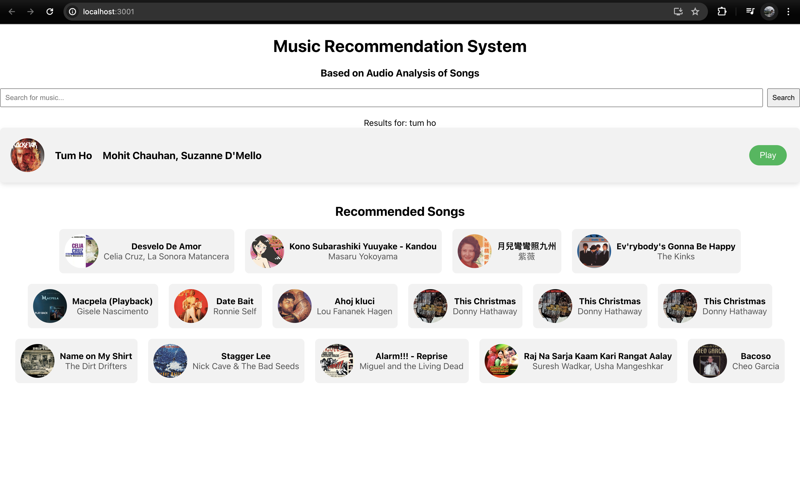
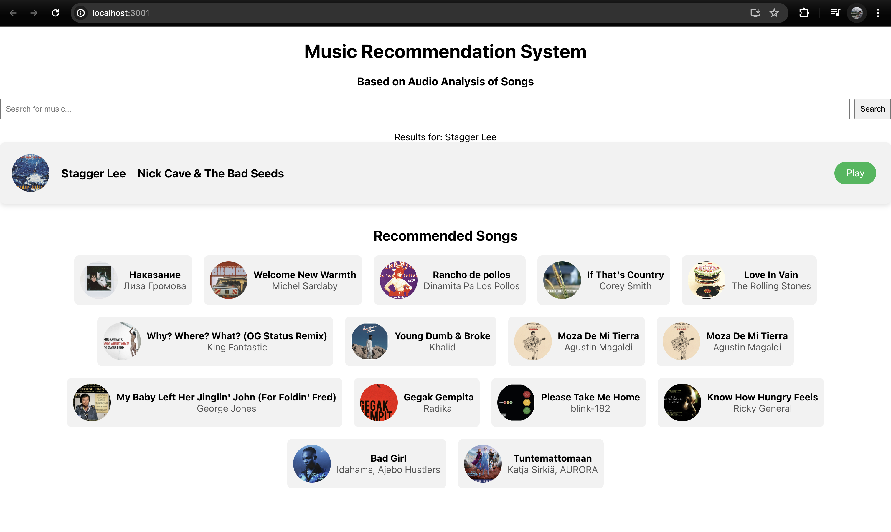

# IR_Project_FrontEnd

- Run the FrontEnd

  ```bash
      cd frontend_dir
      npm install
      npm start
  ```

- Update Spotify token before running interacting with Spotify API

- Update token in App.js file

- Screenshots:



